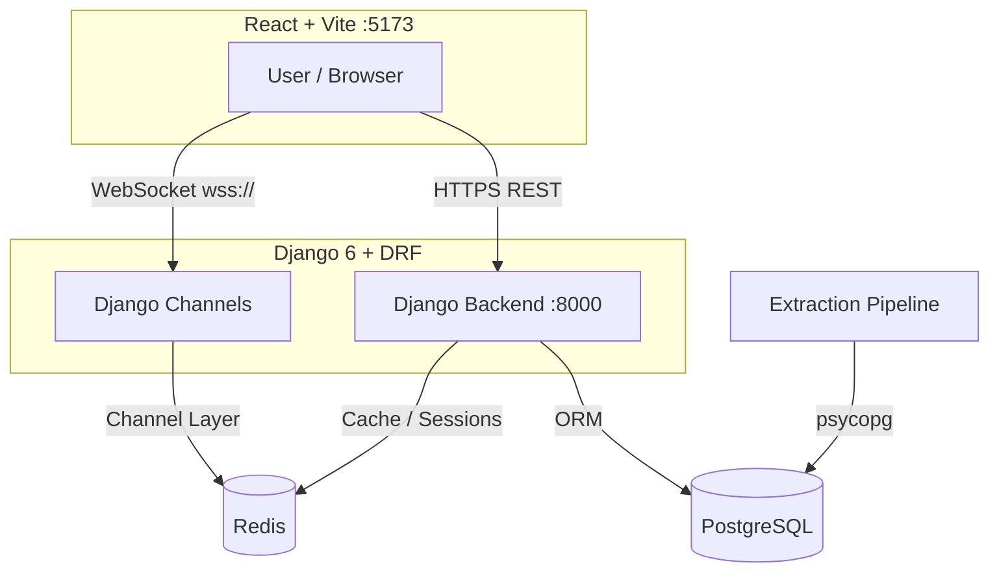
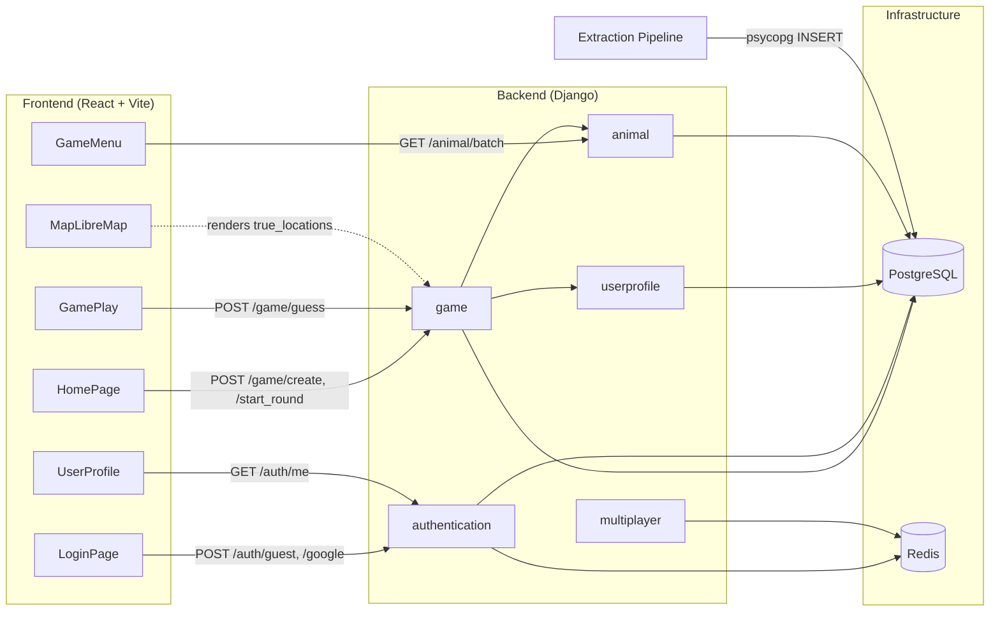

# 🌍 BioGuesser V2

A full-stack probabilistic animal-habitat guessing game. Players are shown an animal and must pin its likely habitat on a world map. Scores are calculated based on real sighting-probability distributions sourced from iNaturalist.

---

## 🏗️ Architecture Overview



---

## 🗺️ Module Dependency Map



---

## 📦 Repository Structure

```
geoguesser-v2/
├── README.md                  ← You are here
├── backend/                   ← Django REST API
│   ├── authentication/        ← JWT auth, Guest & Google login
│   ├── game/                  ← Rooms, rounds, scoring engine
│   ├── animal/                ← Animal & location models
│   ├── userprofile/           ← Per-user stats
│   ├── multiplayer/           ← WebSocket consumers (Django Channels)
│   └── backend/               ← Django settings, urls, asgi/wsgi
├── frontend/frontend/         ← React + Vite SPA
│   └── src/
│       ├── pages/             ← HomePage, LoginPage
│       └── components/        ← GameMenu, GamePlay, AnimalCard, MapLibreMap, UserProfile
└── extraction/                ← iNaturalist data ingestion scripts
```

---

## ⚡ Quick Start

### Prerequisites

| Tool       | Version              |
| ---------- | -------------------- |
| Python     | 3.11+                |
| Node.js    | 18+                  |
| PostgreSQL | 14+                  |
| Redis      | 6+                   |
| uv         | latest (recommended) |

### 1. Databases

```bash
# Docker (quickest)
docker run --name postgres -e POSTGRES_PASSWORD=root -p 5432:5432 -d postgres
docker run --name redis -p 6379:6379 -d redis
```

### 2. Backend

```bash
cd backend
uv venv && source .venv/bin/activate
uv pip install -r requirements.txt
cp .env.example .env          # fill in DB / Redis / Google credentials
uv run manage.py migrate
uv run manage.py runserver
```

### 3. Frontend

```bash
cd frontend/frontend
npm install
# create .env with VITE_API_BASE_URL=http://localhost:8000/api
npm run dev
```

### 4. Data Ingestion _(optional — seed animals)_

```bash
cd extraction
uv pip install psycopg[binary] aiohttp python-dotenv h3
# add animal names to animals.txt, then:
uv run ingest_Data.py
```

---

## 🔗 Module Documentation

| Module           | README                                                                 |
| ---------------- | ---------------------------------------------------------------------- |
| Backend (core)   | [backend/README.md](./backend/README.md)                               |
| Authentication   | [backend/authentication/README.md](./backend/authentication/README.md) |
| Multiplayer (WS) | [backend/multiplayer/README.md](./backend/multiplayer/README.md)       |
| Frontend         | [frontend/frontend/README.md](./frontend/frontend/README.md)           |
| Data Extraction  | [extraction/README.md](./extraction/README.md)                         |
