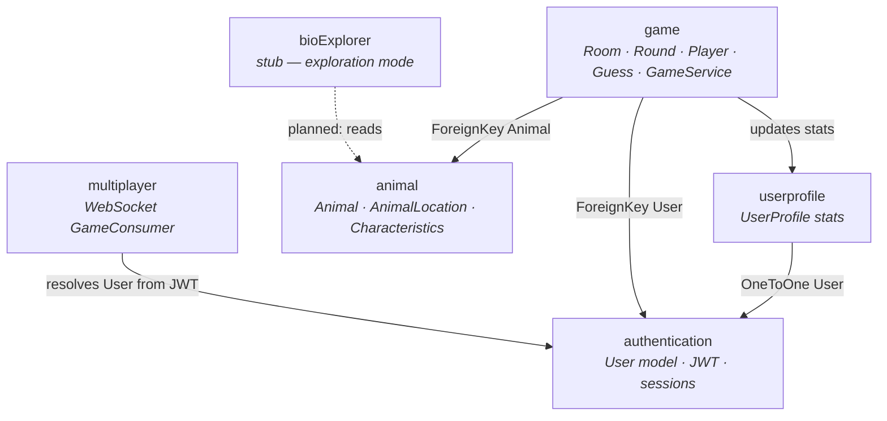
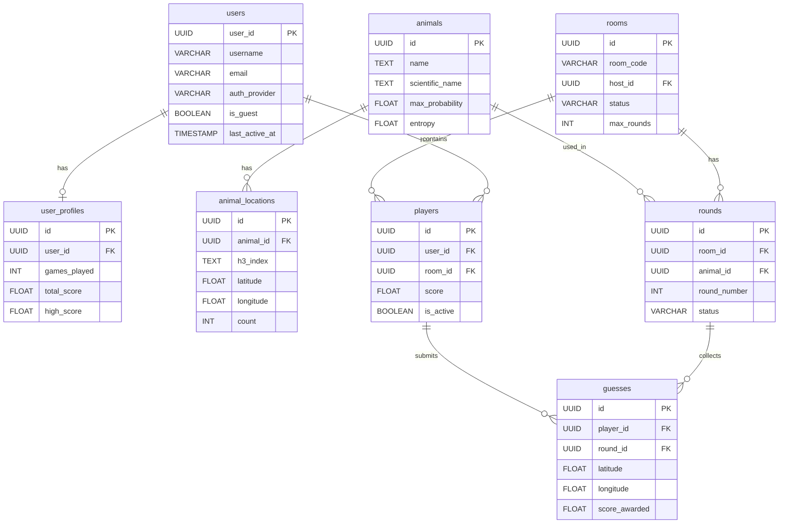
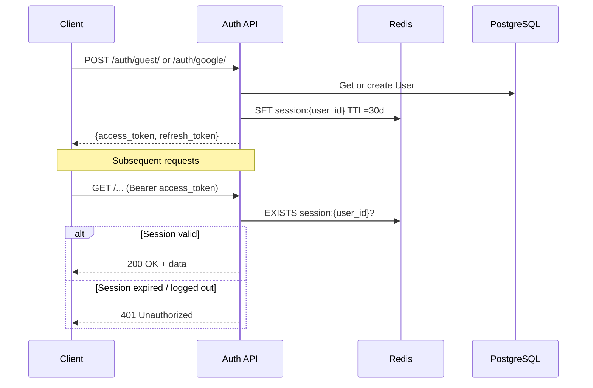
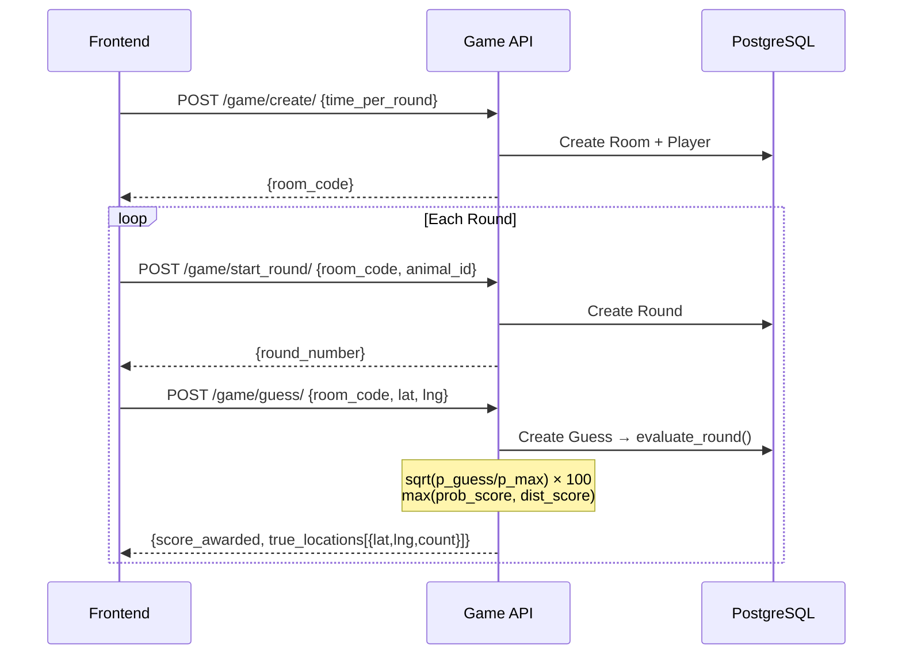
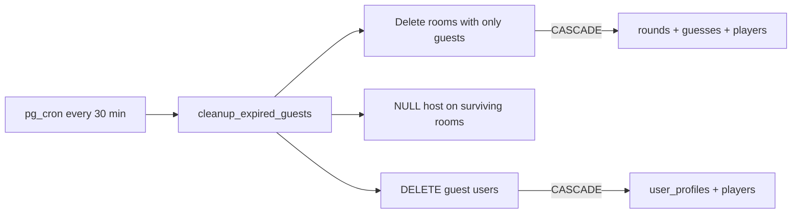

# Backend — BioGuesser V2

Django 6 + Django REST Framework REST API and WebSocket server.

---

## 🛠️ Tech Stack

| Layer            | Technology                                 |
| ---------------- | ------------------------------------------ |
| Framework        | Django 6.0 + DRF 3.16                      |
| Auth             | JWT (SimpleJWT) + Redis session validation |
| Database         | PostgreSQL 14+                             |
| Cache / Pub-Sub  | Redis                                      |
| Real-time        | Django Channels (ASGI)                     |
| Spatial indexing | H3 Geo (Uber) — resolution 2               |
| Package runner   | `uv`                                       |

---

## ⚙️ Setup

```bash
cd backend
uv venv && source .venv/bin/activate
uv pip install -r requirements.txt

# Configure environment
cp .env.example .env   # edit with your credentials

uv run manage.py migrate
uv run manage.py runserver
```

### Required `.env` variables

```ini
SECRET_KEY=change-me
DEBUG=True

DB_NAME=bio_geo_guesser
DB_USER=postgres
DB_PASSWORD=root
DB_HOST=localhost
DB_PORT=5432

REDIS_HOST=localhost
REDIS_PORT=6379

GOOGLE_CLIENT_ID=your-google-client-id
```

---

## 📂 App Structure

```
backend/
├── backend/          # settings.py, urls.py, wsgi.py, asgi.py
├── authentication/   # User model, JWT auth, Guest/Google login
├── animal/           # Animal + AnimalLocation models (managed=False)
├── game/             # Room, Player, Round, Guess, scoring engine
├── userprofile/      # UserProfile (stats per user)
└── multiplayer/      # Django Channels WebSocket consumers
```

---

## � App Dependency Graph



---

## �🗄️ Database Schema



---

## 🔐 Authentication Flow

See [authentication/README.md](./authentication/README.md) for full endpoint documentation.



---

## 🎮 Game Flow



---

## 🔢 Scoring Formula

```
p_guess  = cell_count / total_sightings          # probability of guessed H3 cell
score_prob = sqrt(p_guess / p_max) × 100         # sqrt-dampened probability score

closest_dist = min haversine distance to any location
score_dist   = exp(−closest_dist / 1000) × 100   # exponential distance fallback

final_score = max(score_prob, score_dist)         # best of the two
final_score = clamp(final_score, 0.5, 100.0)     # floor 0.5 for real guesses
```

**Score table (examples)**

| Situation                                  | Score |
| ------------------------------------------ | ----- |
| Perfect hotspot cell                       | ~100  |
| Cell with 50% of peak density              | ~71   |
| Cell with 5% of peak density               | ~22   |
| 0 km from nearest sighting (distance path) | 100   |
| 500 km away                                | ~61   |
| 1000 km away                               | ~37   |
| Timed out (no guess)                       | 0     |

---

## 🧹 Automatic Guest Cleanup (pg_cron)

Stale guest users (inactive > 2 hours) and all their related data are purged by a scheduled PostgreSQL stored procedure. See [`delete_temp_users.sql`](./delete_temp_users.sql).


